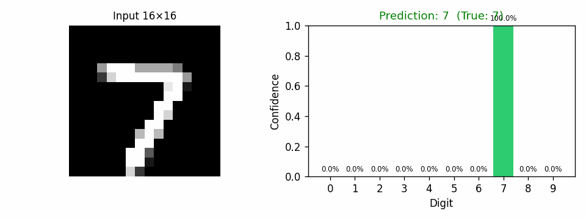
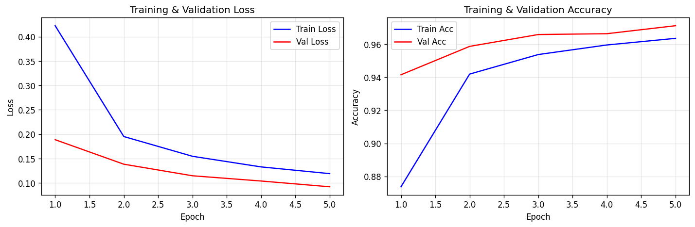
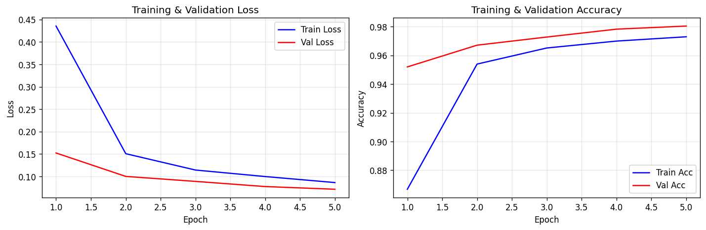
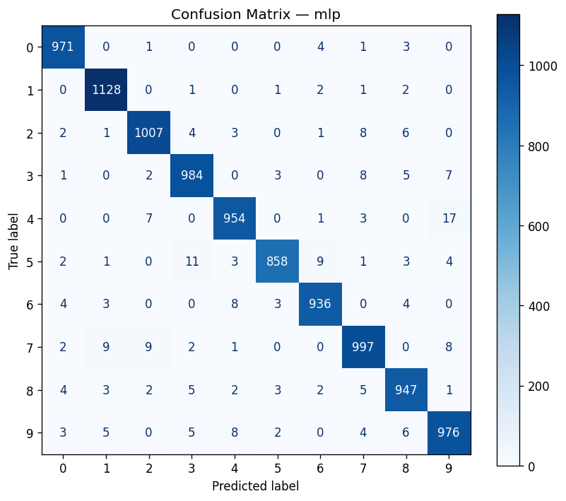
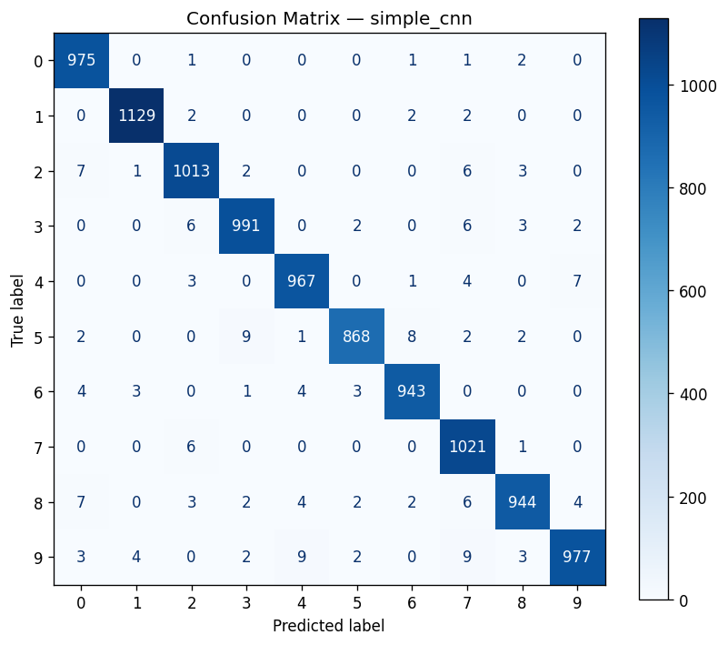
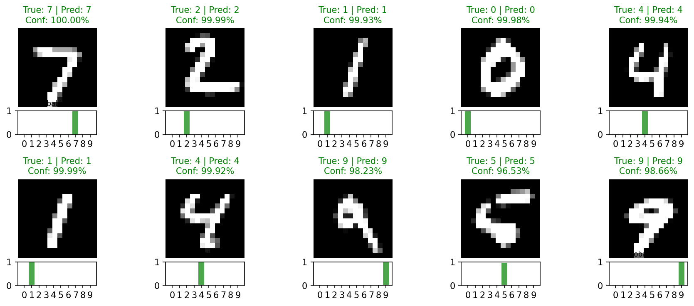

<p align="center">
  
</p>

<h1 align="center">Digit16 CNN 🔢</h1>

<p align="center">
  <b>16×16 手写数字识别 · MLP vs CNN 对比实验</b>
</p>

<p align="center">
  
  
  
  
  
  
</p>

---

## 📋 项目简介

一个 **麻雀虽小五脏俱全** 的 CNN 实验项目——在 16×16 低分辨率图像上做手写数字识别，对比 **MLP（全连接）** 与 **CNN（卷积）** 两种架构的表现差异，附带一个鼠标交互的实时预测 Demo。

**设计原则：** CPU 可跑、五分钟出结果、代码结构清晰易改。

**解决的问题：**
- 在极小分辨率（16×16）下，CNN 的局部特征提取是否优于 MLP？
- 在 **参数更少** 的情况下（CNN 18k vs MLP 42k），CNN 能否表现更好？

---

## 🚀 快速开始

```bash
git clone git@github.com:runzhong123-max/digit16-cnn-openclaw.git
cd digit16-cnn-openclaw
python3 -m venv venv && source venv/bin/activate
pip install -r requirements.txt
```

### 三个命令

```bash
# 1. 冒烟测试（1 分钟）
python scripts/smoke_test.py

# 2. 正式实验（2 分钟）
python scripts/run_experiment.py

# 3. 交互 Demo（画数字，实时预测）
python demo/matplotlib_digit_demo.py
```

---

## 📊 实验结果

| 模型 | 参数量 | 验证集最佳 Acc | 测试集 Acc | Macro F1 | 训练时间 |
|------|--------|---------------|-----------|----------|---------|
| **MLP** | 41,802 | 97.12% | 97.58% | 0.9757 | 16.6s |
| **SimpleCNN** | **18,346** | **98.05%** | **98.28%** | **0.9826** | 31.2s |

**核心结论：** CNN 用不到 **一半的参数** 达到了更高的精度，验证了卷积在图像上的局部特征提取优势。

### 训练曲线

<table>
  <tr>
    <td></td>
    <td></td>
  </tr>
  <tr>
    <td align="center">MLP 训练曲线</td>
    <td align="center">SimpleCNN 训练曲线</td>
  </tr>
</table>

### 混淆矩阵

<table>
  <tr>
    <td></td>
    <td></td>
  </tr>
  <tr>
    <td align="center">MLP 混淆矩阵</td>
    <td align="center">SimpleCNN 混淆矩阵</td>
  </tr>
</table>

### Demo 效果预览

<div align="center">
  
  <br/>
  <em>模型在测试集上的预测示例（绿色=正确，红色=错误）</em>
</div>

---

## 🧠 模型架构

### MLP Baseline (42k params)

```
Input: 256 (flattened 16×16)
  ↓
FC(256 → 128) + ReLU + Dropout(0.2)
  ↓
FC(128 → 64) + ReLU + Dropout(0.2)
  ↓
FC(64 → 10)
```

### SimpleCNN (18k params)

```
Input: 1×16×16
  ↓
Conv(1→8, 3×3, pad=1) + ReLU + MaxPool(2)    → 8×8×8
  ↓
Conv(8→16, 3×3, pad=1) + ReLU + MaxPool(2)    → 16×4×4
  ↓
Flatten → 256
  ↓
FC(256 → 64) + ReLU + Dropout(0.25)
  ↓
FC(64 → 10)
```

---

## 🎮 交互 Demo

```bash
python demo/matplotlib_digit_demo.py
```

| 操作 | 方式 |
|------|------|
| 画数字 | 左键拖拽 |
| 擦除 | 右键拖拽 |
| 预测 | 点击 Predict / 按 `p` |
| 清空 | 点击 Clear / 按 `c` |
| 保存图像 | 点击 Save / 按 `s` |

> ⚠️ **分布差异：** Demo 中用鼠标画的数字（二值）与 MNIST 下采样图像（平滑灰度）分布不同，预测精度可能低于测试集报告值。

---

## 📁 项目结构

```
digit16-cnn-experiment/
├── README.md                    ← 就是这个文件
├── requirements.txt             ← 依赖（7 个包）
├── configs/
│   └── default.yaml             ← 超参数配置
├── src/
│   ├── models.py                ← MLP + SimpleCNN 定义
│   ├── data.py                  ← MNIST → 16×16 数据加载
│   ├── train.py                 ← 训练循环
│   ├── evaluate.py              ← 测试评估
│   ├── infer.py                 ← 推理接口
│   └── utils.py                 ← 工具函数
├── scripts/
│   ├── smoke_test.py            ← 冒烟测试（1 epoch）
│   ├── run_experiment.py        ← 正式实验
│   └── generate_demo_gif.py     ← 生成 GIF 预览
├── demo/
│   └── matplotlib_digit_demo.py ← 交互画板 Demo
├── docs/
│   ├── experiment_report.md     ← 完整实验报告
│   └── figures/                 ← 结果图表
└── results/                     ← 实验结果（gitignored）
```

---

## ⚙️ 拿来就改

改 `configs/default.yaml` 就能直接调参数重跑：

```yaml
epochs: 10          # 多练几轮
learning_rate: 0.0005
batch_size: 32
```

改模型直接编辑 `src/models.py`，加层或改通道数，然后：

```bash
python scripts/run_experiment.py
```

---

## 🔬 局限性 & 下一步

### 当前局限

- 只有 5 个 epoch，模型未完全收敛
- 无数据增强
- 单次 seed 结果，可能有随机波动
- CNN 仅 2 个卷积层，容量有限

### 可以尝试的改进

- [ ] 增加训练轮数至 10-20
- [ ] 添加数据增强（旋转、平移）
- [ ] 对比 8×8 / 16×16 / 28×28 不同分辨率
- [ ] 尝试 BatchNorm、学习率调度
- [ ] 多次运行取均值+标准差

---

## 📎 依赖

- Python 3.9+
- PyTorch + torchvision
- numpy, pandas, matplotlib
- scikit-learn, pyyaml
- Pillow（GIF 生成）
- **纯 CPU 即可运行**

---

<p align="center">
  <sub>Made by Ryan · HUST CS · 2026</sub>
</p>
